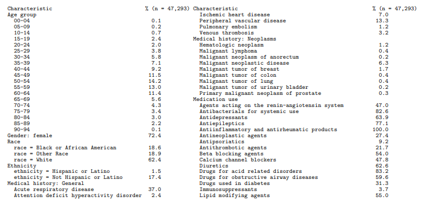
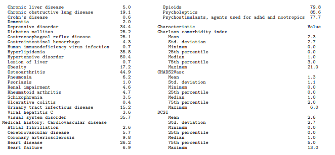

```{r set-options,echo=FALSE,message=FALSE,warning=FALSE,eval=TRUE}
options(width=200)
library(FeatureExtraction)
vignetteFolder <- "s:/temp/vignetteFeatureExtraction"
```
\fontsize{10}{12}
\selectfont

# 서론

특징추출 패키지는 공통 데이터모델에 저장된 정보를 사용하여 집단(cohort)을 위한 특징(feature)을 만들 수 있다.  집단이란 일정 기간동안 하나 이상의 포함 기준을 만족하는 사람들의 집합으로 정의된다. 예를 들어 집단에 들어가기 전에 관찰된 진단이 특징일 수 있다. 어떤 사람들은 또한 '기준 특성'과 같은 특징이나 일반적으로 '공변량'으로 불리는 특징들을 언급할 수 있으며, 우리는 이러한 용어들을 이 글 전체에 걸쳐서 상호교환하여 사용할 것이다.

이 글은 패키지에 포함된 기본 공변량 정의를 사용하여 특징들을 구성하는 방법을 설명한다. 이러한 정의들은 미리 정의된 매개 변수들을 통해 상당히 많은 사용자설정을 허용하지만, 누군가 더 많은 사용자설정이 필요할 수 있다. 이 경우 독자는 제대로 사용자 공변량을 다루는 이 패키지에 포함된 다른 글을 참조하면 된다.

이 글은 먼저 어떤 특징들을 구성할지 지정하는 방법을 설명한다. 많은 상황에서 예를들어 FeatureExtraction을 CohortMethod 또는 PatientLevelPrediction과 같은 다른 패키지의 일부로 사용하는 경우 실제 패키지 호출이 다른 패키지에 의해 일어나므로 FeatureExtraction 패키지에 대해 알아야 할 모든 것이 있습니다. 그러나 집단의 설명을 종이에 작성하려면 이 패키지를 자체적으로 사용하는 것도 가능합니다.

# 공변량 설정

사용자는 다음 세가지 방법으로 구성할 공변량을 지정할 수 있다.

1. 기본 공변량 집합 선택
2. 사전에 지정된 분석 집합에서 선택
3. 사용자 정의 분석 집합 생성

**분석**은 하나 이상의 유사한 공변량을 생성하는 과정이다. 예를 들어 하나의 분석은 코호트 시작(cohort start)전 해에 조건_발생 표에서 관측된 각 조건에 대해 이진 공변량을 생성할 수 있으며, 다른 분석에서는 찰 슨 공변성 지수를 나타내는 단일 공변량을 생성할 수 있다.

특징들을 구성하는데 사용할수 있거나 사용할 수 없는 개념 ID 집합을 지정하는 것이 항상 가능하다. 기본 집합(옵션 1) 또는 사전 지정된 분석(옵션 2)을선택할 때는 모든 분석에서 이 작업을 수행 할 수 있다. 사용자 정의 분석(옵션 3)을 생성 할 때 분석별로 지정할 수 있다

**고급 사용자를 위해:**  생성해야 하는 공변량 ID 집합을 지정할 수도 있다. 한 개의 공변량 ID는 특정 공변량을 식별한다(예: Charlson Comorbidity 지수 도는 특정 시간에서 특정 조건 개념의 발생). 그러므로 공변량 ID는 개념ID와 혼동하면 안된다. 생성할 공변량 ID를 지정할 수 있는 일반적인 시나리오는 누군가가 이미 한 모집단에서 공변량을 만들었거나 공변량의 하위 집합을 찾아냈거나, 다른 모집단에서 구성된 공변량을 가지고 싶을 경우이다

## 기본 공변량 집합 사용하기

기본 공변량 집합을 사용하는 것은 간단하다:

    settings <-createDefaultCovariateSettings()

이것은 인구통계학에서부터 조건과 약물을 통한 여러 위험 점수까지 다양한 특징들을 만들어 낼 것이다.

공변량을 생성하는데 사용해서는 안되는 개념집합을 지정할 수도 있다

예를들어:

    settings <-createDefaultCovariateSettings(excludedCovariateConceptIds = 1124300,
    																					addDescendantsToExclude = TRUE)

이것은 개념 1124300(성분 디클로페낙)과 그 후손들(즉, 디클로페낙 성분을 함유한 모든 약물)에서 파생된 것을 제외하고 기본 공변량 집합을 생성한다.

## 사전 지정된 분석 사용

createCovariateSettings 기능은 사용자가 미리 정의된 공변량 집합에서 선택 할 수 있도록 한다.

사용 가능한 옵션에 대한 개요를 보려면 createCovariateSettings를 사용한다

예를들어:

    settings <-createCovariateSettings(useDemographicsGender = TRUE,
    																	 useDemographicsAgeGroup = TRUE,
    																	 useConditionOccurrenceAnyTimePrior = TRUE)

이렇게 하면 성별, 연령(5세 그룹) 및 코호트 시작 날짜 이전의(그리고 포함하는) 조건_발생가능에서 관찰된 각 개념에 대한 이진 공변량이 생성된다.

사전 지정된 분석 중 많은 부분이 단기, 중기 또는 장기 기간을 나타낸다. 기본적으로 밑에와 같이 정의 된다

- 장기 : 코호트 시작 날짜까지 365일 이전 및 포함.
- 중기 : 최대 180일 전 및 코호트 시작 날짜 포함.
- 단기 : 코호트 시작일로부터 최대 30일 전까지.

그러나 사용자는 이러한 값을 변경 할 수 있다.

예를들어:

    settings <-createCovariateSettings(useConditionEraLongTerm = TRUE,
    																	 useConditionEraShortTerm = TRUE,
    																	 useDrugEraLongTerm = TRUE,
    																	 useDrugEraShortTerm = TRUE,
    																	 longTermStartDays = -180,
    																	 shortTermStartDays = -14,
    																	 endDays = -1)

이것은 코호트 시작일로부터 180일 전(포함하지않음)까지 장기를 재정의하고 코호트 시작일로부터 14일 전(포함하지 않음)까지 단기를 재정의 한다.

또한 공변량 구성에 사용해야 하는 개념ID를 지정할 수도 안할 수도 있다.

    settings <-createCovariateSettings(useConditionEraLongTerm = TRUE,
    																	 useConditionEraShortTerm = TRUE,
    																	 useDrugEraLongTerm = TRUE,
    																	 useDrugEraShortTerm = TRUE,
    																	 longTermStartDays = -180,
    																	 shortTermStartDays = -14,
    																	 endDays = -1,
    																	 excludedCovariateConceptIds = 1124300,
    																	 addDescendantsToExclude = TRUE)

## 사용자 공변량 집합을 생성

이 옵션은 **고급 사용자**만 사용해야 한다. 구현 레벨에서 분석은 고도로 매개 변수화 된 SQL과 매개 변수 값의 스펙을 결합한 것임을 이해해야한다. 사용 가능한 옵션을 이해하는가장 좋은방법은 사전 지정된 분석을 시작점으로 잡고 그것을 상세한 설정 객체로 바꾸는 것이다

    settings <-createCovariateSettings(useConditionEraLongTerm = TRUE)
    settings2 <-convertPrespecSettingsToDetailedSettings(settings)
    settings2$analyses[[1]]
    
    ## 결과
    ## $analysisId
    ## [1] 202
    ##
    ## $sqlFileName
    ## [1] "DomainConcept.sql"
    ##
    ## $parameters
    ## $parameters$analysisId
    ## [1] 202
    ##
    ## $parameters$analysisName
    ## [1] "ConditionEraLongTerm"
    ##
    ## $parameters$startDay
    ## [1] -365
    ##
    ## $parameters$endDay
    ## [1] 0
    ##
    ## $parameters$subType
    ## [1] "all"
    ##
    ## $parameters$domainId
    ## [1] "Condition"
    ##
    ## $parameters$domainTable
    ## [1] "condition_era"
    ##
    ## $parameters$domainConceptId
    ## [1] "condition_concept_id"3
    ##
    ## $parameters$domainStartDate
    ## [1] "condition_era_start_date"
    ##
    ## $parameters$domainEndDate
    ## [1] "condition_era_end_date"
    ##
    ## $parameters$description
    ## [1] "One covariate per condition in the condition_era table overlapping with any part of the long term window."
    ##
    ##
    ## $includedCovariateConceptIds
    ## list()
    ##
    ## $includedCovariateIds
    ## list()
    ##
    ## $addDescendantsToInclude
    ## [1] FALSE
    ##
    ## $excludedCovariateConceptIds
    ## list()
    ##
    ## $addDescendantsToExclude
    ## [1] FALSE

상세 분석 설정 객체를 처음부터 만들 수 있고 이것을 사용하여 세부 설정 객체를 생성한다

    analysisDetails <-createAnalysisDetails(analysisId = 1,
    																				sqlFileName = "DemographicsGender.sql",
    																				parameters =list(analysisId = 1,
    																												 analysisName = "Gender",
    																												 domainId = "Demographics"),
    																				includedCovariateConceptIds =c(),
    																				addDescendantsToInclude = FALSE,
    																				excludedCovariateConceptIds =c(),
    																				addDescendantsToExclude = FALSE,
    																				includedCovariateIds =c())
    settings <-createDetailedCovariateSettings(list(analysisDetails))

##  시간 공변량

일반적으로 공변량은 관심 있는 단 몇 개의 시간(예: 앞에서 설명한 단기,중기,장기)에 대해서만 생성된다.

그러나 때로는 더 세세하게 시간을 분해하는 것이 필요할 때도 있다. 예를 들어, 코호트 시작 365일 전에 각 날짜에 대한 공변량을 별도로 작성한다. 우리는 이런 종류의 공변량을 시간 공변량이라고 한다.

시간 공변량은 시간대에서 동일한 공변량 ID 공유하며 별도의 시간 ID를 사용하여 시간대를 구별합니다. 현재는 시간 공변량을 처리할 수 있는 많은 어플리케이션이 없다. 예를들어 CohortMethod 패키지는 시간 공변량을 제공할 때 깨진다. 그러나  PatientLevelPrediction 패키지에는 시간 공변량이 필요한 기계 학습 알고리즘이 있다. 

다시 기본설정을 사용하도록 선택할 수 있음

    settings <-createDefaultTemporalCovariateSettings()

또는, 미리 정해진 시간 공변량 중에서 선택할 수 있다.

    settings <-createTemporalCovariateSettings(useConditionOccurrence = TRUE,
    																					 useMeasurementValue = TRUE)

이 경우 우리는 condition_occurrence 테이블의 각 개념에 대해 이진 공변량을  생성하기로 선택하였고, CDM의 measurement 테이블에 있는 각 측정 조합에 대해 연속 공변량을 생성하기로 했다. 기본적으로 시간 공변량은 코호트 시작일 365일 전(포함하지 않음)에 개별적으로 각 날에 대해 생성된다. 다른 시간대를 지정할수도 있수도 있는데 예를 들면 밑에 코드처럼 7일간격으로 만들 수 있다

    settings <-createTemporalCovariateSettings(useConditionOccurrence = TRUE,
    																					 useMeasurementValue = TRUE,
    																					 temporalStartDays =seq(-364, -7, by = 7),
    																					 temporalEndDays =seq(-358, -1, by = 7))

각 시간대는 지정된 시작일과 종료일을 포함한다. 일반 공변량과 유사하게 **고급 사용자**도 사용자 정의 분석을 정의할 수 있다.

    analysisDetails <-createAnalysisDetails(analysisId = 1,
    																				sqlFileName = "MeasurementValue.sql",
    																				parameters =list(analysisId = 1,
    																												 analysisName = "MeasurementValue",
    																												 domainId = "Measurement"),
    																				includedCovariateConceptIds =c(),
    																				addDescendantsToInclude = FALSE,
    																				excludedCovariateConceptIds =c(),
    																				addDescendantsToExclude = FALSE,
    																				includedCovariateIds =c())
    settings <-createDetailedTemporalCovariateSettings(list(analysisDetails))

# 관심 코호트에 대한 공변량 구성

여기서는 두 개의 관심 코호트에 대한 공변량 생성, 즉 diclofenaca의 새로운 사용자와 cellecoxi의 새로운 사용자 예를 살펴보기로 한다.

## 서버 연결 설정

우리는 R언어로 데이터가 있는 서버와 연결하는 방법을 알아야 한다. CohortMethod는 createConnectionDetails 함수를 제공하는 DatabaseConnector 패키지를 사용한다

다양한 데이터베이스 관리 시스템 (DBMS)에 필요한 특정 설정을 위한 createConnectionDetails을 사용한다. 예를들어 이 코드를 사용하여 PostgreSQL 데이터베이스에 연결할 수 있다.

    connectionDetails <-createConnectionDetails(dbms = "postgresql",
    																						server = "localhost/ohdsi",
    																						user = "joe",
    																						password = "supersecret")
    cdmDatabaseSchema <- "my_cdm_data"
    resultsDatabaseSchema <- "my_results"

마지막 두 라인은 cdmDatabaseSchema 변수와 resultsDatabaseSchema 변수를 정의했다. 나중에 CDM 형식의 데이터가 어디에 있는지, 중간 및 결과 표를 작성하려는 위치를 R언어로 접근하기 위해 이러한 변수를 사용한다. Microsoft SQL Server의 경우 데이터베이스 스키마는 데이터베이스와 스키마를 모두 지정해야하므로 예를 들어 cdmDatabaseSchema <- "my_cdm_data.dbo" 이런식이다.

## 관심 코호트 생성

FeatureExtraction을 사용하려면 공통 데이터 모델의 코호트 테이블 또는 코호트 테이블과 동일한 구조를 갖는 테이블에서 코호트를 인스턴스화 해야한다. 코호트 정의 툴로 코호트를 만들 수 있지만 여기서는 간단한 SQL을 사용하여 1인당 첫번째 약물시기를 찾는다. 코호트를 시작하기 전에 공변량을 생성하기 때문에 첫번째 노출 전에 365일 간의 관찰이 필요하다. FeatureExtraction가 지정된 기간 동안 피사체가 관찰되는지 여부를 확인하지 않는다.

/****************************************

***File cohortsOfInterest.sql***

****************************************/

    IF OBJECT_ID('@resultsDatabaseSchema.cohorts_of_interest','U') IS NOT NULL
    	DROP TABLE@resultsDatabaseSchema.cohorts_of_interest;
    SELECT first_use.*
    INTO @resultsDatabaseSchema.cohorts_of_interest
    FROM(
    	SELECT drug_concept_id AS cohort_definition_id,
    	MIN(drug_era_start_date)AS cohort_start_date,
    	MIN(drug_era_end_date) AS cohort_end_date,
    	person_id
    FROM @cdmDatabaseSchema.drug_era
    WHERE drug_concept_id=1118084 -- celecoxib
    	OR drug_concept_id=1124300 --diclofenac
    GROUP BYdrug_concept_id,
    	person_id
    ) first_use
    INNER JOIN @cdmDatabaseSchema.observation_period
    	ON first_use.person_id=observation_period.person_id
    	AND cohort_start_date>=observation_period_start_date
    	AND cohort_end_date<=observation_period_end_date 
    WHERE DATEDIFF(DAY, observation_period_start_date, cohort_start_date)>=365;

이 Sql은 SqlRender 패키지에서 사용할 수 있는 매개변수화된 SQL이다.  매개 변수가 있는 SQL을 사용하므로 CDM 및 결과 스키마의 이름을 미리 지정할 필요가 없다. 그런 식으로 다른 스키마에서 SQL을 실행하려면 매개 변수 값만 변경하면 된다. 우리는 SQL 코드를 변경할 필요가 없다. 또한 SqlRender의 번역 기능을 사용하여 다양한 환경에서 SQL 코드를 실행할 수 있다.

    library(SqlRender)
    sql <-readSql("cohortsOfInterest.sql")
    sql <-render(sql,
    						 cdmDatabaseSchema = cdmDatabaseSchema,
    						 resultsDatabaseSchema = resultsDatabaseSchema)
    sql <-translate(sql, targetDialect = connectionDetails$dbms)
    connection <-connect(connectionDetails)
    executeSql(connection, sql)

이 코드에서는 먼저 파일에서 메모리로 SQL을 읽는다. 다음 줄에서는 두 개의 매개 변수 이름을 실제 값으로 대체한다. 그런 다음 SQL을 연결 세부 정보에서 이미 지정되어있는 DBMS에 적합한 방언으로 변환한다. 다음으로, 우리는 서버에 연결하고 렌더링되고 번역 된 SQL을 제출한다.

지금까지 잘했다면, 우리는 이제 관심 코호트의 테이블을 만들었다. 우리는 한 종류당 얼마나 많은 이벤트를 볼 수 있는 지 알 수 있다.

    sql <-paste("SELECT cohort_definition_id, COUNT(*) AS count",
    						"FROM @resultsDatabaseSchema.cohorts_of_interest",
    						"GROUP BY cohort_definition_id")
    sql <-render(sql, resultsDatabaseSchema = resultsDatabaseSchema)
    sql <-translate(sql, targetDialect = connectionDetails$dbms)
    querySql(connection, sql)
    
    ## 결과
    ##   cohort_concept_id  count
    ## 1           1124300 240761
    ## 2           1118084  47293

## 관심 코호트에 대한 1인당 공변량 생성

예를 들어 기본 설정을 사용하여 관심 코호트 중 하나에 대한 1인당 공변량을 생성 할 수 있다.

    covariateSettings <-createDefaultCovariateSettings()
    covariateData <-getDbCovariateData(connectionDetails = connectionDetails,
    																	 cdmDatabaseSchema = cdmDatabaseSchema,
    																	 cohortDatabaseSchema = resultsDatabaseSchema,
    																	 cohortTable = "cohorts_of_interest",
    																	 cohortId = 1118084,
    																	 rowIdField = "subject_id",
    																	 covariateSettings = covariateSettings)
    summary(covariateData)
    
    ## 결과
    ## CovariateData object summary
    ##
    ## Number of covariates: 41330
    ## Number of non-zero covariate values: 25892630

###  사용자 공변량 출력 형식

covariateData 객체의 주요 구성 요소는 공변량이다.

covariateData$covariates

    ## ffdf (all open) dim=c(25892630,3), dimorder=c(1,2) row.names=NULL
    ## ffdf virtual mapping
    ##                PhysicalName VirtualVmode PhysicalVmode  AsIs VirtualIsMatrix PhysicalIsMatrix PhysicalElementNo PhysicalFirstCol PhysicalLastCol PhysicalIsOpen
    ## rowId                 rowId      integer       integer FALSE           FALSE            FALSE                 3                1               1           TRUE
    ## covariateId        list...1       double        double FALSE           FALSE            FALSE                 1                1               1           TRUE
    ## covariateValue     list...2       double        double FALSE           FALSE            FALSE                 2                1               1           TRUE
    ## ffdf data
    ##               rowId covariateId covariateValue
    ## 1                 1  4185976212              1
    ## 2                 2   316866212              1
    ## 3                 3  4028876212              1
    ## 4                 4  4132926212              1
    ## 5                 5   318736212              1
    ## 6                 6  4208390212              1
    ## 7                 7  4154739212              1
    ## 8                 8  4197065212              1
    ## 25892623   25892623        1903              3
    ## 25892624   25892624        1903              1
    ## 25892625   25892625        1903              2
    ## 25892626   25892626        1903              1
    ## 25892627   25892627        1903              2
    ## 25892628   25892628        1903              3
    ## 25892629   25892629        1903              1
    ## 25892630   25892630        1903              2

컬럼들은 다음과 같이 정의된다

- rowId 고유하게 코호트 항목을 식별한다. getDbCovariateData를 호출 할 때 rowIdField = "subject_id"를 정의 했으므로 이 경우 rowId는 코호트 테이블의 subject_id와 동일하다. 하나의 주제가 한 번 이상 코호트에 나타날 수있는 경우 각 코호트 항목을 고유하게 식별하는 필드를 코호트 테이블에 작성하고 이를 rowId 필드로 사용하는 것은 사용자에게 달려있다.
- covariate는 공변량을 식별하고 covariates의 정의는 cohortData$covariateRef 객체에서 찾을 수 있다.
- covariateValue 필드는 값을 제공한다.

###  데이터를 파일로 저장

공변량을 생성하는 것은 상당한 컴퓨팅 시간이 들고, 미래를 대비하여 향후 세션을 위해 공변량을 저장하는 것이 좋을 것이다.   covariateDataobjects는 ff를 사용하므로 R의 일반 저장 함수를 사용할 수 없다. 대신 saveCovariateData () 함수를 사용해야한다.

    saveCovariateData(covariateData, "covariates")

loadCovariateData() 함수를 사용하여 향후 세션에 데이터를 로드할 수 있다.

###  간헐적인 공변량 제거, 정규화 및 중복 제거

1인당 공변량을 생성하는 이유중 하나는 기계학습에서 공변량을 사용하기 때문일 수 있다. 이 경우 하기전에 데이터를 정리해야 할 수 있다. 

tidyCovariateData 함수는 세가지 작업을 할 수 있다.

1. **간헐적인 공변량 제거** : 종종 대부분의 특징들은 코호트의 한명의 피실험자나 또는 몇명의 피실험자에 대해 0이 아닌 값을 가진다. 이러한 특징들은 어떤 적합 모델에서도 끝나지 않지만 컴퓨팅 계산의 부담을 증가시키므로 제거하면 성능이 향상된다.
2. **정규화** : 모든 공변량 값을 (각 공변량의 최대값으로 나누어서) 0과 1 사이의 값으로 조정한다.
3. **중복 제거** : 코호트의 모든 사람이 공변량에 대해 동일한 값을 갖는 경우(예: 여성에게 제한된 코호트는 모두에 대해 동일한 성별 공변량값을 가짐)에는 공변량이 중복된다. 중복된 공변량은 일부 기계학습 알고리즘에 문제를 유발한다. 예를 들어 단순 회귀 분석에서 더 이상 단일의 답이 되지 않는다. 마찬가지로 공변량 그룹도 중복될 수 있다.(예: 모든 사람은 적어도 한 연령 그룹에 속할 것이고,하나의 그룹은 다른 그룹의 부재로 정의 될 수 있으므로 중복된다.)

    tidyCovariates <-tidyCovariateData(covariateData,minFraction = 0.001,
    																	 normalize = TRUE,
    																	 removeRedundancy = TRUE)

몇 개의 간헐적인 공변량이 제거되었는지 알고 싶다면 metaData 객체를 쓰면 된다

    deletedCovariateIds <- tidyCovariates$metaData$deletedInfrequentCovariateIds
    head(deletedCovariateIds)
    
    ## 결과
    ## [1]        3 22274210 22274212 22288210 22340212 22350210

비슷하게, 중복된 공변량이 제거되었는지 알고 싶으면 metaData 객체를 쓰면 된다.

    deletedCovariateIds <- tidyCovariates$metaData$deletedRedundantCovariateIds
    head(deletedCovariateIds)
    
    ## 결과
    ##     covariateId                     covariateName analysisId conceptId
    ## 1       8527004                      race = White          4      8527
    ## 2       8532001                   gender = FEMALE          1      8532
    ## 3       2015006                  index year: 2015          6         0
    ## 4          1007                    index month: 1          7         0
    ## 5  900000010802 ...tance Abuse Coverage Indicator        802 900000010
    ## 6   21603933412 ...EUMATIC PRODUCTS, NON-STEROIDS        412  21603933
    ## 7   21603932412 ...ORY AND ANTIRHEUMATIC PRODUCTS        412  21603932
    ## 8   21603932410 ...ORY AND ANTIRHEUMATIC PRODUCTS        410  21603932
    ## 9    1118084412 ...s relative to index: celecoxib        412   1118084
    ## 10   1118084410 ...s relative to index: celecoxib        410   1118084
    ## 11  21603991410 ...days relative to index: Coxibs        410  21603991
    ## 12  21603931412 ...index: MUSCULO-SKELETAL SYSTEM        412  21603931
    ## 13  21603991412 ...days relative to index: Coxibs        412  21603991
    ## 14  21603931410 ...index: MUSCULO-SKELETAL SYSTEM        410  21603931
    ## 15  21603933410 ...EUMATIC PRODUCTS, NON-STEROIDS        410  21603933
    ## 16  21603933413 ...EUMATIC PRODUCTS, NON-STEROIDS        413  21603933
    ## 17  21603932413 ...ORY AND ANTIRHEUMATIC PRODUCTS        413  21603932
    ## 18   1118084413 ...s relative to index: celecoxib        413   1118084
    ## 19  21603931413 ...index: MUSCULO-SKELETAL SYSTEM        413  21603931
    ## 20  21603991413 ...days relative to index: Coxibs        413  21603991

## 코호트에 대한 집계 공변량 생성

종종 우리는 1인당 공변량을 만들 필요는 없지만, 대신에 우리는 통합 통계을 만들어야 할 수도 있다. 예를 들어, 우리는 어떤 사람이 남자인지 알 필요가 없을 수도 있지만, 코호트의 비율이 남자인지 알고 싶을수도 있다.

밑에 코드로 1인당 공변량을 집계할 수 있다.

    covariateData2 <-aggregateCovariates(covariateData)

물론 우리가 원하는 모든 것이 집계된 통계였다면, 생성 과정에서 그것들을 종합하는게 더 효율적일 것이다.

    covariateSettings <-createDefaultCovariateSettings()
    covariateData2 <-getDbCovariateData(connectionDetails = connectionDetails,
    																		cdmDatabaseSchema = cdmDatabaseSchema,
    																		cohortDatabaseSchema = resultsDatabaseSchema,
    																		cohortTable = "cohorts_of_interest",
    																		cohortId = 1118084,
    																		covariateSettings = covariateSettings,
    																		aggregated = TRUE)
    summary(covariateData2)
    
    ## 결과
    ## CovariateData object summary
    ##
    ## Number of covariates: 41330
    ## Number of non-zero covariate values: 41330

aggregated = TRUE로 지정했다. 또한 더 이상 personId 데이터를 받지 않기 때문에 더 이상 rowIdField를 정의 할 필요가 없다.

### 집계 공변량 출력 형식

집합 된 covariateData 객체의 두 가지 주요 구성 요소는 각각 이진 및 연속 공변량에 대한 공변량 및 공변 연속이다.

    covariateData2$covariates
    
    ## 결과
    ## ffdf (all open) dim=c(41326,3), dimorder=c(1,2) row.names=NULL
    ## ffdf virtual mapping
    ##              PhysicalName VirtualVmode PhysicalVmode  AsIs VirtualIsMatrix PhysicalIsMatrix PhysicalElementNo PhysicalFirstCol PhysicalLastCol PhysicalIsOpen
    ## covariateId        list..       double        double FALSE           FALSE            FALSE                 1                1               1           TRUE
    ## sumValue         list...1       double        double FALSE           FALSE            FALSE                 2                1               1           TRUE
    ## averageValue     list...2       double        double FALSE           FALSE            FALSE                 3                1               1           TRUE
    ## ffdf data
    ##        covariateId     sumValue averageValue
    ## 1     1.978072e+08 4.000000e+00 8.457911e-05
    ## 2     4.133018e+09 6.000000e+00 1.268687e-04
    ## 3     4.369452e+08 3.000000e+01 6.343433e-04
    ## 4     3.141032e+08 2.000000e+00 4.228956e-05
    ## 5     1.343122e+08 9.000000e+00 1.903030e-04
    ## 6     4.181339e+09 6.000000e+00 1.268687e-04
    ## 7     4.054827e+09 1.200000e+01 2.537373e-04
    ## 8     4.389632e+08 1.000000e+00 2.114478e-05
    ## :                :            :            :
    ## 41319 2.211822e+09 6.000000e+00 1.268687e-04
    ## 41320 2.211878e+09 2.000000e+00 4.228956e-05
    ## 41321 2.313614e+09 5.000000e+00 1.057239e-04
    ## 41322 2.313664e+09 1.000000e+00 2.114478e-05
    ## 41323 2.314111e+09 8.000000e+00 1.691582e-04
    ## 41324 2.514442e+09 2.370000e+02 5.011312e-03
    ## 41325 2.514467e+09 2.300000e+01 4.863299e-04
    ## 41326 2.721532e+09 1.000000e+00 2.114478e-05

    covariateData2$covariatesContinuous
    
    ## 결과
    ## ffdf (all open) dim=c(4,11), dimorder=c(1,2) row.names=NULL
    ## ffdf virtual mapping
    ##                   PhysicalName VirtualVmode PhysicalVmode  AsIs VirtualIsMatrix PhysicalIsMatrix PhysicalElementNo PhysicalFirstCol PhysicalLastCol PhysicalIsOpen
    ## covariateId             list..       double        double FALSE           FALSE            FALSE                 1                1               1           TRUE
    ## countValue            list...1       double        double FALSE           FALSE            FALSE                 2                1               1           TRUE
    ## minValue              list...2       double        double FALSE           FALSE            FALSE                 3                1               1           TRUE
    ## maxValue              list...3       double        double FALSE           FALSE            FALSE                 4                1               1           TRUE
    ## averageValue          list...4       double        double FALSE           FALSE            FALSE                 5                1               1           TRUE
    ## standardDeviation     list...5       double        double FALSE           FALSE            FALSE                 6                1               1           TRUE
    ## medianValue           list...6       double        double FALSE           FALSE            FALSE                 7                1               1           TRUE
    ## p10Value              list...7       double        double FALSE           FALSE            FALSE                 8                1               1           TRUE
    ## p25Value              list...8       double        double FALSE           FALSE            FALSE                 9                1               1           TRUE
    ## p75Value              list...9       double        double FALSE           FALSE            FALSE                10                1               1           TRUE
    ## p90Value             list...10       double        double FALSE           FALSE            FALSE                11                1               1           TRUE
    ## ffdf data
    ##    covariateId   countValue     minValue     maxValue averageValue standardDeviation  medianValue     p10Value     p25Value     p75Value     p90Value
    ## 1  1901.000000 33013.000000     0.000000    21.000000     2.321168          2.657008     1.000000     0.000000     0.000000     3.000000     6.000000
    ## 2  1904.000000 31301.000000     0.000000     6.000000     1.307128          1.144543     1.000000     0.000000     0.000000     2.000000     3.000000
    ## 3  1902.000000 27951.000000     0.000000    13.000000     2.646671          2.723938     1.000000     0.000000     0.000000     5.000000     7.000000
    ## 4  1903.000000 30898.000000     0.000000     5.000000     1.234157          1.055174     1.000000
    

covariates의 컬럼은 다음과 같이 정의된다

- covariateId는 공변량을 식별하며, 공변량의 정의는 cohortData$covariateRef 객체에서 찾을 수 있다
- sumValue는 공변량 값의 합이다. 이것들은 이진 특성들이기 때문에, 공변량 값이 1인 사람들의 수와 같다.
- averageValue는 평균 공변량 값이다. 이것들은 이진 특성들이기 때문에, 공변량 값이 1인 사람들의 비율과 같습니다

covariatesContinuous의 컬럼은 다음과 같이 정의된다

- covariateId는 공변량을 식별하며, 공변량의 정의는 cohortData$covariateRef 객체에서 찾을 수 있다
- countValue는 값이 있는 사람의 수입니다(연속된 변수일 경우)
- minValue,maxValue,averageValue,standardDeviation,medianValue,p10Value,p25Value,p75Value,p90Value 들은 공변량 값의 분포를 알려준다. 일부 공변량(예: Charlson comorbitity index)의 경우 0 값은 0으로 해석되지만 다른 공변량(예: 혈압)의 경우 0은 누락된 값으로 해석되며 분포 통계는 비누락 값에 대해서만 계산된다는 점을 유의해야 한다. 어떤 연속 공변량이 어떤 범주에 속하는지 알아보려면  covariateData$analysisRef 객체의 missingMeansZero 필드를 참조하면 된다.

##  테이블 만들기 1

특징추출 패키지가 지원하는 한 가지 과제는 논문에 포함시킬 수 있는 전체 학습 인구 특성 테이블을 만드는 것이다. 이것은 일반적으로 첫 번째 테이블이므로 테이블를 '테이블1'이라고 합니다. 특징추출 패키지에서 기본 테이블 1을 사용 할 수 있다.

    result <-createTable1(covariateData2)
    print(result, row.names = FALSE, right = FALSE
    
    ## 결과는 밑에 사진





적용 가능한 경우, 이러한 특성은 긴 시간대와 관련된 분석에 도출되며, 코호트 시작 날짜부터 365일까지의 관찰된 개념을 포함했다.  createTable1 함수는 테이블에 포함 할 변수를 간단하게 지정해야 한다. 패키지에 포함 된 기본 스펙은 getDefaultTable1Specifications 함수를 호출하여 볼 수 있다. 스펙 참조 분석 ID 와 공변량 ID 및 기본 스펙 ID는 기본 공변량 설정의 ID를 참조한다. 대신에 사용자 지정 테이블 1 스펙을 만들어서 사용할 수 있다.

여기서는 테이블에 공변량의 작은 부분 만 사용 되더라도 모든 기본 공변량을 포함하는 covariateData 객체에 대해 테이블 1을 기반으로 한다. 테이블에 필요한 공변량 만 추출하려는 경우 createTable1CovariateSettings 함수를 사용할 수 있다.

    covariateSettings <-createTable1CovariateSettings()
    covariateData2b <-getDbCovariateData(connectionDetails = connectionDetails,
    																		 cdmDatabaseSchema = cdmDatabaseSchema,
    																		 cohortDatabaseSchema = resultsDatabaseSchema,
    																		 cohortTable = "cohorts_of_interest",
    																		 cohortId = 1118084,
    																		 covariateSettings = covariateSettings,
    																		 ;aggregated = TRUE)
    summary(covariateData2b)
    
    ## 결과
    ## CovariateData object summary##
    ## Number of covariates: 90
    ## Number of non-zero covariate values: 90

4.  두 개의 코호트 비교

특징추출 패키지가 지원하는 또 다른 기능 두 가지 관심 코호트를 비교하는 것이다.

기본 테이블 1에 포함된 변수에만 두 개의  코호트를 비교하려는 경우를 가정해보자

    settings <-createTable1CovariateSettings(excludedCovariateConceptIds =c(1118084, 1124300),
    																				 addDescendantsToExclude = TRUE)
    
    covCelecoxib <-getDbCovariateData(connectionDetails = connectionDetails,
    																	cdmDatabaseSchema = cdmDatabaseSchema,
    																	cohortDatabaseSchema = resultsDatabaseSchema,
    																	cohortTable = "cohorts_of_interest",
    																	cohortId = 1118084,
    																	covariateSettings = settings,
    																	aggregated = TRUE)
    
    covDiclofenac <-getDbCovariateData(connectionDetails = connectionDetails,
    																	 cdmDatabaseSchema = cdmDatabaseSchema,cohortDatabaseSchema = resultsDatabaseSchema,
    																	 cohortTable = "cohorts_of_interest",cohortId = 1124300,
    																	 covariateSettings = settings,
    																	 aggregated = TRUE)
    
    std <-computeStandardizedDifference(covCelecoxib, covDiclofenac)
    

위의 예에서는 celecoxib (1118084)와 diclofenac (1124300)의 두 가지 코호트를 정의하는 데 사용 된 두 가지 개념에서 파생 된 공변량을 제외하기로 하였다. 나머지 공변량 간의 표준화 된 차이를 계산한다.

    head(std)
    
    
    ##    covariateId    mean1      sd1       mean2      sd2     sd         stdDiff                 covariateName
    ## 69 21601387410 0.27393060 0.5233893 1.0000000 1.0000021 1.1286897  0.6432852 ...o index: ANTINEOPLASTIC AGENTS
    ## 74 21601853410 0.54965851 0.7413974 1.0000000 1.0000021 1.2448591  0.3617610 ... index: LIPID MODIFYING AGENTS
    ## 901904 1.30712790 1.1445434 0.9100477 1.0777444 1.5721045 -0.2525787                    CHADS2VASc
    ## 43003 0.02404161 0.1550552 0.1183165 0.3439724 0.3773051  0.2498638                     age group: 15-19
    ## 2480180210 0.44879792 0.6699309 0.2619693 0.5118305 0.8430764 -0.2216034       ...ative to index: Osteoarthritis
    ## 891902 2.64667075 2.7239376 1.8278085 2.6827256 3.8231993 -0.2141825         ...orbidity Severity Index (DCSI)

stdDiff 열에는 표준화 된 차이가 있습니다. 기본적으로데이터는 표준화된 차이의 절대 값을 기준으로 내림차순으로 정렬되며, 가장 큰 차이가 있는 공변량이 먼저 표시 됩니다.

우리는 또한 비교를 표준 테이블 1로 보여줄 수 있다.


